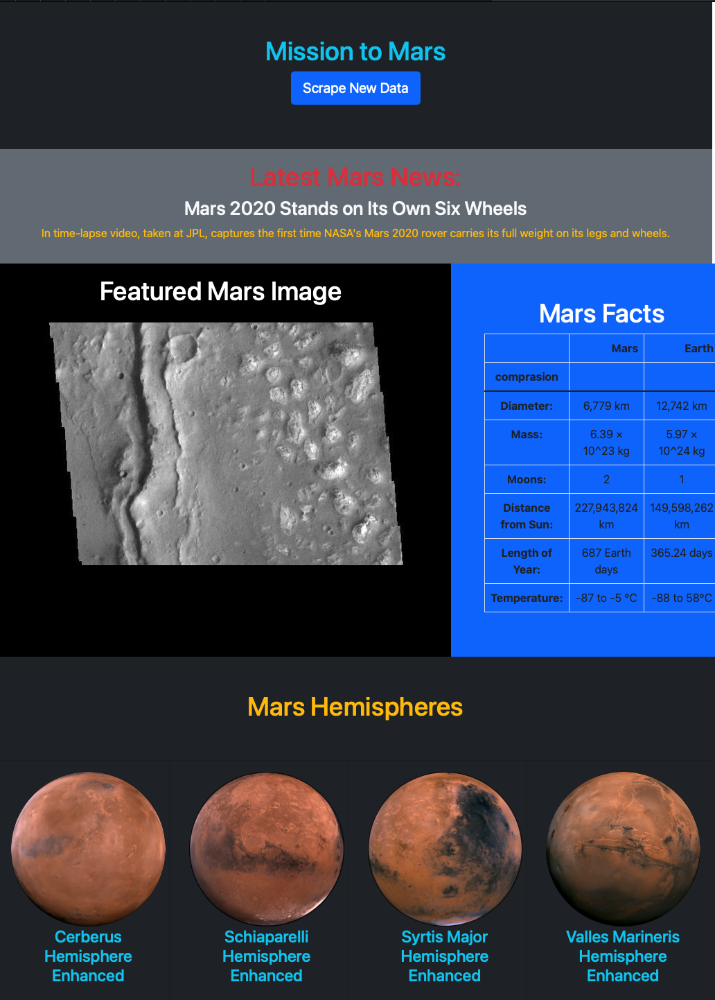

# Mission to Mars

In this assignment, I have built a web application that scrapes various websites for data related to the Mission to Mars and displayed the information in a single HTML page. 

## Step 1 - Scraping

Completed  initial scraping using Jupyter Notebook, BeautifulSoup, Pandas, and Requests/Splinter.

* Jupyter Notebook  `mission_to_mars.ipynb` contains all of scraping and analysis tasks. 

### NASA Mars News

* Scraped the [Mars News Site](https://redplanetscience.com/) and collect the latest News Title and Paragraph Text. 

### JPL Mars Space Images - Featured Image

* Visited the url for the Featured Space Image site [here](https://spaceimages-mars.com).

* Used splinter to navigate the site and find the image url for the current Featured Mars Image and assign the url string to a variable called `featured_image_url`.

### Mars Facts

* Visited the Mars Facts webpage [here](https://galaxyfacts-mars.com) and use Pandas to scrape the table containing facts about the planet including Diameter, Mass, etc.

* Used Pandas to convert the data to a HTML table string.

### Mars Hemispheres

* Visited the astrogeology site [here](https://marshemispheres.com/) to obtain high resolution images for each of Mar's hemispheres.

## Step 2 - MongoDB and Flask Application

Used MongoDB with Flask templating to create a new HTML page that displays all of the information that was scraped from the URLs above.

* Created a route called `/scrape` that  import  `scrape_mars.py` script and call  `scrape` function.

  * Stored the return value in Mongo as a Python dictionary.

* Created a root route `/` that query Mongo database and pass the mars data into an HTML template to display the data.

* Created a template HTML file called `index.html` that  take the mars data dictionary and display all of the data in the appropriate HTML elements. 

